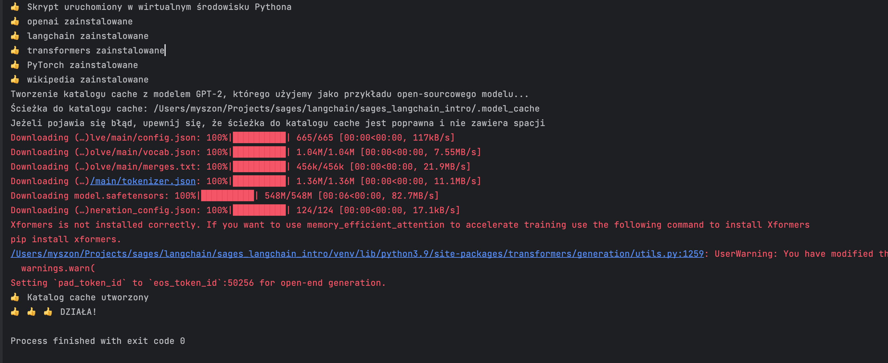

# Instalacja

## Python

Używamy Python 3.9, ale prawdopodobnie każda wersja powyżej 3.7 zadziała.

## Repozytorium

1. Proszę pobrać zawartość repozytorium.
2. Proszę otworzyć katalog z zawartością jako nowy projekt w PyCharm/IntelliJ.

## Przygotowanie środowiska

1. Otwieramy "module settings". 

Dla osób używających PyCharm: instrukcja jak znaleźć opcję zmiany interpretera Pythona: https://www.jetbrains.com/help/pycharm/configuring-python-interpreter.html (nastepnie przechodzimy do punktu 3)

2. Otwieramy zakładkę "Project".

3. Dodajemy nowy Python SDK.

4. W kolejnym oknie wybieramy Virtualenv Environment i zostawiamy wartości domyślne (zakładamy, że wyświetla się jakaś wersja Pythona). Klikamy OK.

5. Otwieramy plik `requirements.txt` znajdujący się w katalogu z projektem. Zawartość pliku będzie inna niż na obrazku. To nie jest błąd.

6. Klikamy link "Install requirements" znajdujący się na belce nad zawartością pliku.

7. Klikamy "Install" i czekamy aż zakończy się instalacja. Proszę zaczekać aż zniknie "progress bar" z paska u dołu okna PyCharm/IntelliJ

8. Otwieramy plik `test_intro.py` znajdujący się w głównym katalogu.

    Ten skrypt sprawdza czy wszystko działa poprawnie.
    
    1. W czasie działania skryptu zostanie utworzony katalog `.model_cache` w aktualnym katalogu roboczym.
    2. Do tego katalogu zostanie pobrany open-sourcowy model LLM, którego użyjemy w czasie zajęć jako alternatywy dla OpenAI.
    3. W czasie zajeć użyjemy tego samego katalogu aby nie tracić czasu na pobieranie modelu.

9. Klikamy prawym przyciskiem na nazwie pliku `test_intro.py` i wybieramy opcję "Run".

10. Jeśli wszystko działa prawidłowo, w konsoli powinniśmy zobaczyć tekst: "Działa!!!". Ostrzeżenia widoczne na poniższej grafice nie mają znaczenia ponieważ nie będziemy używać tych funkcji.

